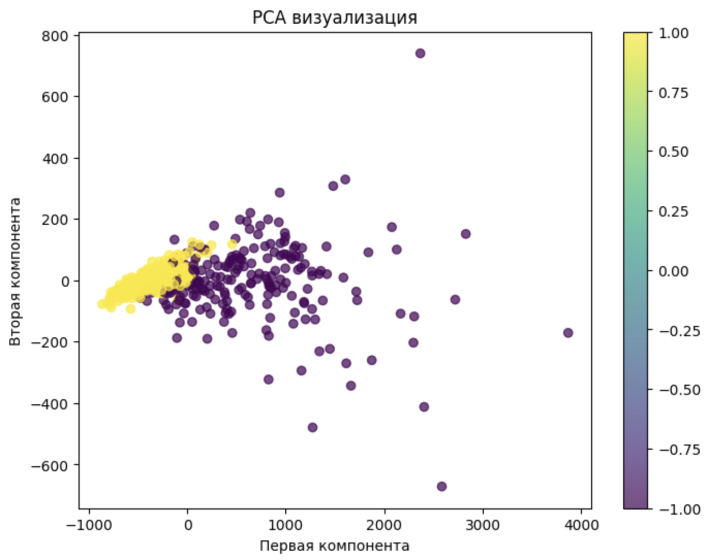
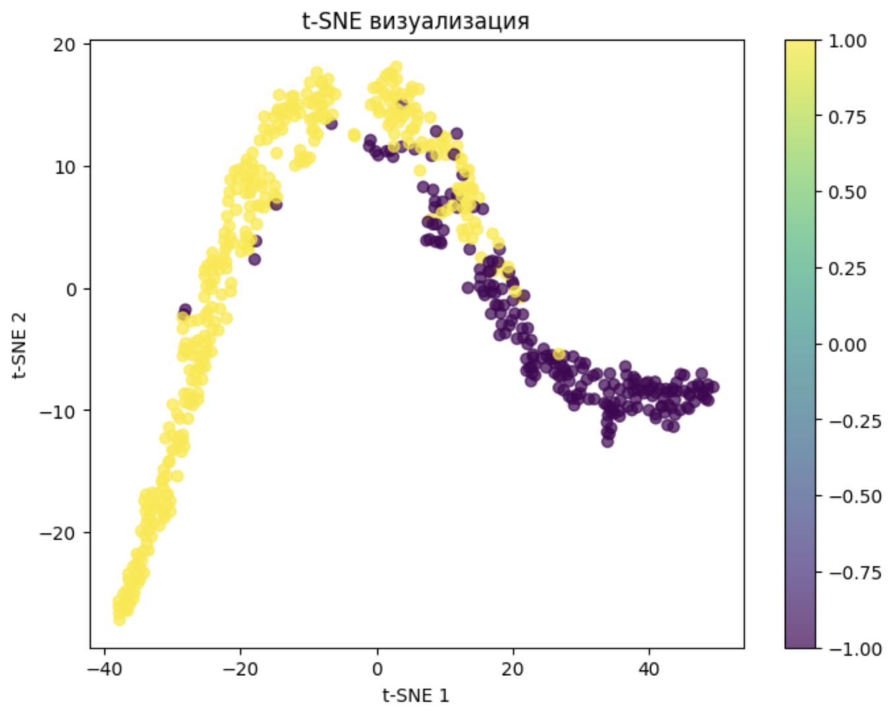
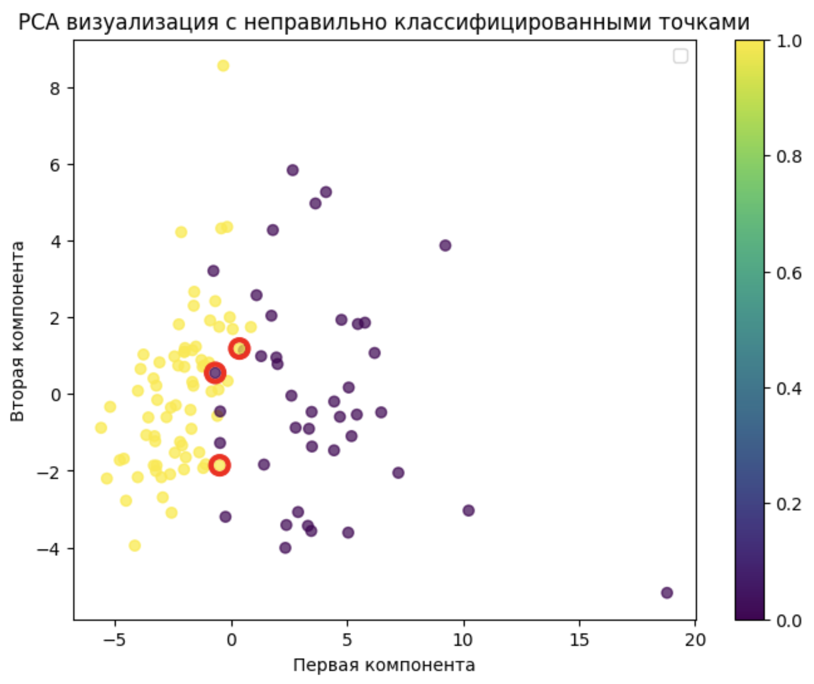

# Отчет по лабораторной работе №3: SVM

## Цель работы

Реализация алгоритма SVM с решением двойственной задачи по лямбда, использованием трюка с ядром для построения нелинейных классификаторов, визуализация решения и сравнение с эталонной реализацией.

## Подготовка данных

**Датасет:** Breast Cancer Wisconsin Dataset (569 образцов, 30 признаков)

- Целевая переменная: бинарная классификация
- Преобразование меток: 0 → -1, 1 → 1
- Нормализация данных: StandardScaler
- Разделение: 80% обучение, 20% тестирование

## Визуализация данных

### PCA визуализация



Анализ показывает наличие двух основных кластеров с некоторым перекрытием, что указывает на возможность построения SVM классификатора с использованием ядерных функций.

### t-SNE визуализация



t-SNE подтверждает наличие двух кластеров с областями перекрытия, что объясняет необходимость использования нелинейных ядер для эффективного разделения классов.

## Реализация алгоритма

### Основные компоненты:

1. **Ядра:**
   - Линейное ядро (LinearKernel)
   - Квадратичное ядро (QuadraticKernel)
   - RBF ядро (RBFKernel) с параметром gamma
2. **Решение двойственной задачи:** scipy.optimize.minimize с методом SLSQP
3. **Оптимизация:** Минимизация функции Лагранжа с ограничениями
4. **Поддержка векторов:** Автоматическое определение опорных векторов

### Ключевые особенности реализации:

- Решение двойственной задачи SVM через квадратичное программирование
- Поддержка различных ядерных функций
- Автоматический расчет bias (w0) через опорные векторы
- Пороговая фильтрация опорных векторов для стабильности

## Результаты экспериментов

### Результаты классификации

**Эталонное решение (sklearn.SVC):**

```
Confusion Matrix:
[[41  1]
 [ 1 71]]

Accuracy: 0.982
Support vectors: 97
```

**Реализованный SVM классификатор:**

```
Confusion Matrix:
[[41  1]
 [ 2 70]]

Accuracy: 0.974
Support vectors: 122
```

### Визуализация решения



Визуализация показывает работу SVM классификатора на тестовой выборке. Красными кругами отмечены неправильно классифицированные объекты. Большинство ошибок классификации происходит в областях перекрытия классов.

## Анализ результатов

### Сравнение с эталоном

| Метрика   | Реализованный | sklearn | Разница |
| --------- | ------------- | ------- | ------- |
| Accuracy  | 0.974         | 0.982   | -0.008  |
| Precision | 0.976         | 0.986   | -0.010  |
| Recall    | 0.972         | 0.986   | -0.014  |
| F1-score  | 0.974         | 0.986   | -0.012  |

Реализованный алгоритм демонстрирует высокую точность классификации с минимальным отставанием от эталонной реализации.

### Анализ опорных векторов

- **Количество опорных векторов:** 122 из 455 обучающих образцов, в sklearn 97

Высокий процент опорных векторов указывает на сложность задачи разделения классов и необходимость использования нелинейных ядер.

## Выводы

1. **Корректность реализации:** Алгоритм SVM успешно реализован с решением двойственной задачи
2. **Качество классификации:** Достигнута высокая точность с минимальным отставанием от эталонной реализации
3. **Эффективность ядер:** RBF ядро обеспечивает эффективное нелинейное разделение классов
4. **Опорные векторы:** Алгоритм корректно определяет опорные векторы и использует их для классификации

Реализованный SVM классификатор демонстрирует работоспособность основных принципов метода опорных векторов и эффективность использования ядерных функций для решения задач бинарной классификации.
