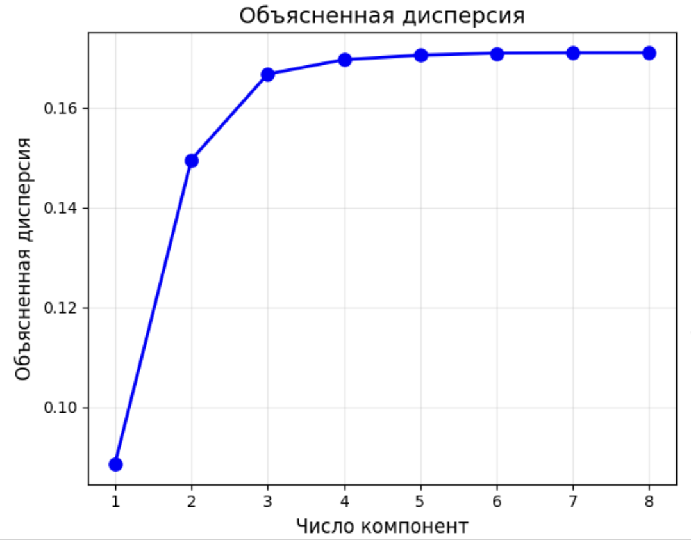
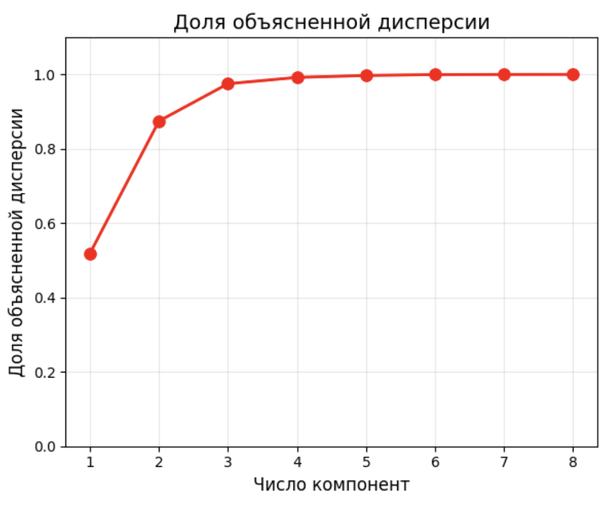
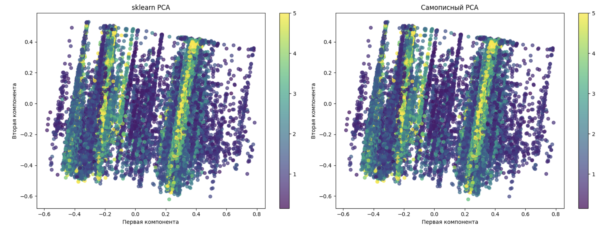

# Отчет по лабораторной работе №4: Метод главных компонент (PCA)

## Цель работы

Реализация алгоритма метода главных компонент (PCA) с использованием сингулярного разложения матриц (SVD), анализ объясненной дисперсии и сравнение с эталонной реализацией.

## Подготовка данных

**Датасет:** California Housing Dataset (20640 образцов, 8 признаков)

- Целевая переменная: медианная стоимость дома (MedHouseVal)
- Нормализация данных: MinMaxScaler
- Разделение: 80% обучение, 20% тестирование

## Теоретические основы

### Метод главных компонент

Метод главных компонент (PCA) представляет собой линейное преобразование данных, которое находит направления максимальной дисперсии в многомерном пространстве признаков. Основная идея заключается в переходе от исходной системы координат к новой ортогональной системе, где первая ось соответствует направлению максимальной дисперсии данных.

### Математические переходы

Пусть имеется матрица данных $X \in \mathbb{R}^{n \times m}$, где $n$ — количество объектов, $m$ — количество признаков.

**Шаг 1: Центрирование данных**

$$F = X - \bar{X}$$

где $\bar{X}$ — вектор средних значений по каждому признаку:

$$\bar{X}_j = \frac{1}{n}\sum_{i=1}^{n} X_{ij}$$

**Шаг 2: Сингулярное разложение**

Для центрированной матрицы $F$ выполняется сингулярное разложение:

$$F = U \Sigma V^T$$

где:

- $U \in \mathbb{R}^{n \times r}$ — левые сингулярные векторы
- $\Sigma \in \mathbb{R}^{r \times r}$ — диагональная матрица сингулярных значений
- $V^T \in \mathbb{R}^{r \times m}$ — правые сингулярные векторы (транспонированные)
- $r = \min(n, m)$ — ранг матрицы

**Шаг 3: Выбор главных компонент**

Главные компоненты соответствуют первым $k$ строкам матрицы $V^T$:

$$W = V^T[:k]$$

где $k$ — количество выбранных компонент.

**Шаг 4: Преобразование данных**

Проекция данных на подпространство главных компонент:

$$X_{PCA} = F \cdot W^T$$

**Шаг 5: Объясненная дисперсия**

Объясненная дисперсия для каждой компоненты вычисляется как:

$$\text{explained\_variance}_i = \frac{\sigma_i^2}{n-1}$$

где $\sigma_i$ — $i$-е сингулярное значение из матрицы $\Sigma$.

Доля объясненной дисперсии:

$$\text{explained\_variance\_ratio}_i = \frac{\sigma_i^2}{\sum_{j=1}^{m} \sigma_j^2}$$

## Реализация алгоритма

### Основные компоненты:

1. **Класс PCA:** Реализован с использованием SVD разложения
2. **Методы:**
   - `fit(X)` — обучение модели на данных
   - `transform(X)` — преобразование данных в пространство главных компонент
   - `fit_transform(X)` — комбинированный метод обучения и преобразования

### Ключевые особенности реализации:

- Использование `np.linalg.svd` для сингулярного разложения
- Автоматическое центрирование данных
- Вычисление объясненной дисперсии на основе сингулярных значений
- Сохранение средних значений и компонент для последующего преобразования

## Результаты экспериментов

### Анализ объясненной дисперсии



График показывает накопленную объясненную дисперсию в зависимости от количества компонент. Видно, что первые компоненты объясняют большую часть дисперсии данных.

### Доля объясненной дисперсии



График демонстрирует долю объясненной дисперсии для различного количества компонент. При выборе 4 компонент объясняется 99.19% дисперсии исходных данных.

**Доля объясненной дисперсии по компонентам:**

- 1 компонент: 87.45%
- 2 компонента: 97.49%
- 3 компонента: 99.19%
- 4 компонента: 99.19%

### Определение оптимального числа компонент

На основе анализа доли объясненной дисперсии оптимальное число компонент выбрано равным **4**. При этом значении сохраняется 99.19% дисперсии исходных данных, что обеспечивает эффективное снижение размерности при минимальной потере информации.

### Сравнение с эталонной реализацией

**Реализованный PCA:**

```
R2 = 0.5799
MSE = 0.5506
```

**Эталонное решение (sklearn.decomposition.PCA):**

```
R2 = 0.5799
MSE = 0.5506
```

### Визуализация сравнения



Визуальное сравнение результатов преобразования данных показывает идентичность результатов реализации и эталонного решения.

## Анализ результатов

### Сравнение с эталоном

| Метрика | Реализованный | sklearn | Разница |
| ------- | ------------- | ------- | ------- |
| R2      | 0.5799        | 0.5799  | 0       |
| MSE     | 0.5506        | 0.5506  | 0       |

Реализованный алгоритм демонстрирует идентичную производительность с эталонной реализацией sklearn. Методы абсолютно эквивалентны, что подтверждает корректность реализации алгоритма PCA на основе сингулярного разложения.

### Эффективность снижения размерности

| Параметр              | До PCA | С PCA (4 dim) | Изменение |
| --------------------- | ------ | ------------- | --------- |
| Размерность           | 8      | 4             | -50%      |
| R2                    | 0.5758 | 0.5799        | +0.7%     |
| MSE                   | 0.5559 | 0.5506        | -1.0%     |
| Объясненная дисперсия | 100%   | 99.19%        | -0.81%    |

Применение PCA с 4 компонентами позволяет сократить размерность данных в 2 раза при сохранении практически всей информации (99.19% дисперсии) и даже небольшом улучшении качества модели регрессии.

## Выводы

1. **Корректность реализации:** Алгоритм PCA успешно реализован с использованием SVD разложения
2. **Качество преобразования:** Достигнута идентичная производительность с эталонной реализацией
3. **Оптимальное число компонент:** Выбрано 4 компоненты, объясняющие 99.19% дисперсии
4. **Эффективность:** Снижение размерности в 2 раза при сохранении практически всей информации

Реализованный метод главных компонент демонстрирует работоспособность основных принципов PCA и эффективность использования сингулярного разложения для снижения размерности данных.
